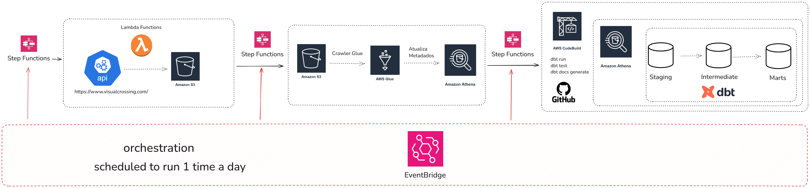

# 🌤️ ClimaBR

**ClimaBR** é um pipeline de dados automatizado na AWS que coleta, processa e transforma informações climáticas provenientes da API pública [Visual Crossing](https://www.visualcrossing.com/), utilizando orquestração via Step Functions e transformação com dbt, com o objetivo de comparar os dados climáticos entre as 27 capitais do Brasil.

## 📌 Visão Geral

O projeto realiza diariamente a ingestão de dados climáticos, salva no Amazon S3, cataloga com o Glue Crawler, executa consultas com Athena e transforma os dados com dbt em três camadas: **Staging**, **Intermediate** e **Marts**.



## 🛠️ Tecnologias Utilizadas

- **AWS Lambda** — coleta dados da API  
- **Amazon S3** — armazenamento dos dados brutos  
- **AWS Glue Crawler** — catalogação automática  
- **Amazon Athena** — análise de dados com SQL  
- **AWS Step Functions** — orquestração dos processos  
- **Amazon EventBridge** — agendamento diário  
- **AWS CodeBuild** — execução automatizada do dbt  
- **dbt Core** — transformação e modelagem dos dados  
- **GitHub** — versionamento do projeto dbt

<details>
  <summary>Ver código da função Lambda</summary>

```python
import json
import os
import requests
import boto3
from datetime import datetime, timedelta

def lambda_handler(event, context):

    capitais = [
        "Rio Branco, BR", "Maceió, BR", "Macapá, BR", "Manaus, BR", "Salvador, BR",
        "Fortaleza, BR", "Brasília, BR", "Vitória, BR", "Goiânia, BR", "São Luís, BR",
        "Cuiabá, BR", "Campo Grande, BR", "Belo Horizonte, BR", "Belém, BR", "João Pessoa, BR",
        "Curitiba, BR", "Recife, BR", "Teresina, BR", "Rio de Janeiro, BR", "Natal, BR",
        "Porto Alegre, BR", "Porto Velho, BR", "Boa Vista, BR", "Florianópolis, BR", "São Paulo, BR",
        "Aracaju, BR", "Palmas, BR"
    ]

    today = datetime.today().date()
    tomorrow = today + timedelta(days=1)

    start_date = today.strftime('%Y-%m-%d')
    end_date = tomorrow.strftime('%Y-%m-%d')
    partition_date = today.strftime('%Y-%m-%d')

    api_key = os.environ['VISUAL_CROSSING_API_KEY'] #Criar variável de ambiente
    bucket_name = os.environ['BUCKET_NAME'] #Criar variável de ambiente
    s3 = boto3.client('s3')

    for cidade in capitais:
        try:
            url = f'https://weather.visualcrossing.com/VisualCrossingWebServices/rest/services/timeline/{cidade}/{start_date}/{end_date}'
            params = {
                'unitGroup': 'metric',
                'include': 'days',
                'key': api_key,
                'contentType': 'json'
            }

            response = requests.get(url, params=params)
            response.raise_for_status()
            data = response.json()

            timestamp = datetime.now().strftime('%Y%m%d%H%M%S')
            cidade_formatada = cidade.replace(', ', '_').replace(' ', '_').lower()
            file_name = f"clima/date={partition_date}/{cidade_formatada}_{timestamp}.json"

            s3.put_object(Bucket=bucket_name, Key=file_name, Body=json.dumps(data))
            print(f"{cidade} salva em {file_name}")

        except Exception as e:
            print(f"Erro ao processar {cidade}: {e}")

    return {
        'statusCode': 200,
        'body': f'Processamento concluído para todas as capitais. Data de particionamento: {partition_date}'
    }
```

</details>

## ⚙️ Pipeline de Execução

1. **Agendamento Diário** (EventBridge)  
2. **Coleta de Dados** da API pela Lambda  
3. **Armazenamento no S3**  
4. **Crawler Glue** atualiza o catálogo  
5. **Athena** atualiza metadados  
6. **Execução dbt** com CodeBuild (run, test, docs)  
7. **Dados Modelados** nas camadas:
   - `staging`
   - `intermediate`
   - `marts`

## 📁 Estrutura de Diretórios dbt

```
ClimaBR/
├── models/
│   ├── staging/
│   │   └── stg_clima.sql                # Modelo raw dos dados da API
│   ├── intermediate/
│   │   └── int_clima_diario.sql         # Enriquecimento dos dados climáticos
│   └── marts/
│       ├── fact_analise_mensal.sql      # Fato mensal de métricas climáticas
│       └── fact_desvio_previsao.sql     # Fato com desvio entre previsão e combinado
├── macros/
├── dbt_project.yml
└── ...
```

## 🧩 Macros dbt

O projeto contém macros personalizadas que auxiliam na transformação dos dados:

```
macros/
├── classify_moon_phase.sql       # Classificação da fase da lua com base na data
├── generate_schema_name.sql      # Geração dinâmica de nomes de schema
├── schema.yml                    # Definições e descrições das macros
```
OBS.: Maiores detalhes na documentação dbt

## 👤 Autor

- **Carlos Oliveira**  
- Contato: [LinkedIn](https://www.linkedin.com/in/carlosoliveira2910/) | [GitHub](https://github.com/ckoliveiraa)
